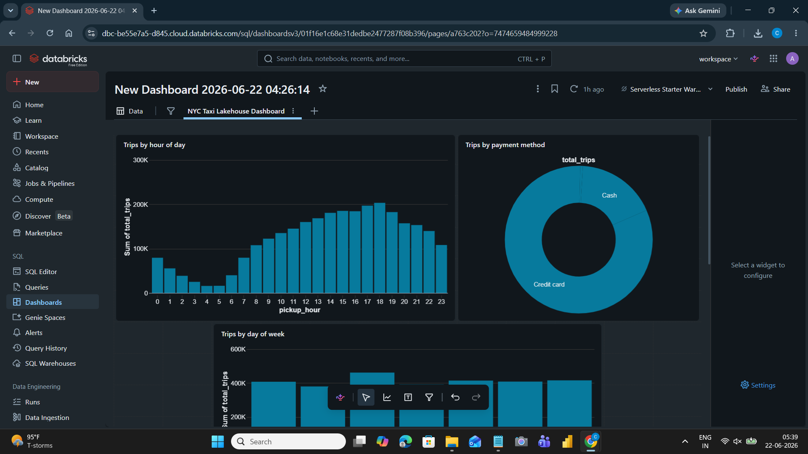
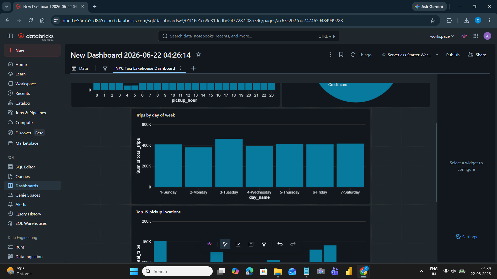
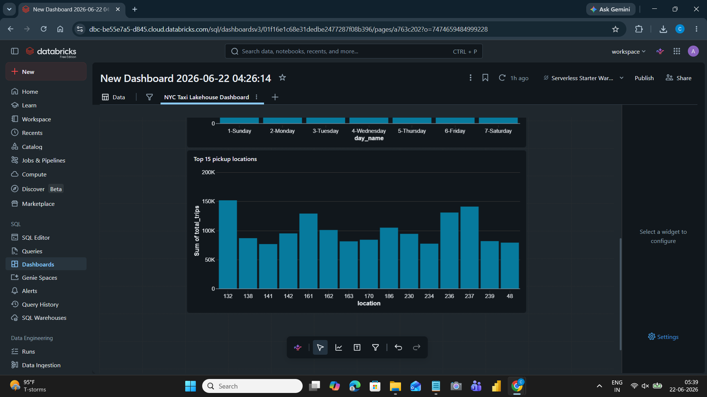

# NYC Taxi Data Lakehouse — Medallion Architecture
### Databricks · Delta Lake · PySpark · Medallion Architecture · SQL Dashboard

> End-to-end data lakehouse built on Databricks Community Edition processing 3M+ NYC Yellow Taxi trips using the Medallion Architecture (Bronze → Silver → Gold). Demonstrates Delta Lake ACID transactions, time travel, schema enforcement, and Databricks SQL dashboards.

[](https://databricks.com)
[](https://delta.io)
[](https://spark.apache.org)
[](https://databricks.com/product/databricks-sql)

---

## Dashboard






> **Live Dashboard:** [View on Databricks]([YOUR_DASHBOARD_URL](https://dbc-be55e7a5-d845.cloud.databricks.com/dashboardsv3/01f16e1c68e31dedbe2477287f08b396/published?o=7474659484999228))
---

## Architecture

```
NYC Yellow Taxi Parquet (Jan 2023 — 3,066,766 rows)
                    │
                    ▼
        ┌─────────────────────┐
        │    BRONZE LAYER     │  Raw ingestion — no transformation
        │  bronze_taxi_raw    │  3,066,766 rows · 19 columns
        └──────────┬──────────┘
                   │  Remove nulls, bad fares, invalid trips
                   ▼
        ┌─────────────────────┐
        │    SILVER LAYER     │  Cleaned, typed, enriched
        │ silver_taxi_cleaned │  2,880,923 rows · 185,843 removed
        └──────────┬──────────┘
                   │  Aggregate by hour, day, payment, location
                   ▼
        ┌─────────────────────────────────────────────┐
        │                GOLD LAYER                   │
        │  gold_hourly_demand     — 24 rows           │
        │  gold_daily_demand      —  7 rows           │
        │  gold_payment_analysis  —  4 rows           │
        │  gold_top_locations     — 50 rows           │
        └──────────────────────────────────────────────┘
                   │
                   ▼
        Databricks SQL Dashboard (4 charts)
```

---

## What this project demonstrates

| Skill | Tool | What you built |
|-------|------|----------------|
| Lakehouse architecture | Databricks | 3-layer medallion pipeline on serverless compute |
| Delta Lake storage | Delta Lake | ACID transactions, time travel, schema enforcement |
| Large-scale processing | PySpark 3.5 | 3M+ row transformations with business rule filtering |
| Data modelling | SQL + PySpark | Fact-style aggregations across 4 Gold tables |
| Analytics dashboard | Databricks SQL | 4 charts — hourly demand, payment, location, weekly |
| Data quality | PySpark filters | 185,843 bad rows removed with documented business rules |

---

## Dataset

**NYC Yellow Taxi Trip Records — January 2023**
- Source: [NYC TLC Trip Record Data](https://www.nyc.gov/site/tlc/about/tlc-trip-record-data.page) (public domain)
- Format: Parquet
- Size: ~45MB / 3,066,766 rows / 19 columns
- Fields: pickup/dropoff timestamps, passenger count, trip distance, fare, tip, tolls, payment type, location IDs

---

## Key findings

**1. Peak demand at 6pm, dead at 4am**
Hourly demand follows a strong diurnal pattern, trips bottom out at hour 3-4 (3-4am) and peak at hour 18 (6pm). This directly informs dynamic pricing and driver allocation strategies.

**2. Credit card dominates — 69% of trips**
Cash payments are a declining minority. The average credit card tip percentage is significantly higher than cash, making payment method a strong predictor of driver earnings.

**3. Tuesday is the busiest day, Sunday the quietest**
Weekday demand (Mon-Fri) substantially outpaces weekend demand in January, suggesting the primary use case is commuter/business travel rather than leisure.

**4. Location 132 (JFK Airport) is the busiest pickup zone**
Airport pickups dominate the top locations list, followed by Midtown Manhattan zones (161, 237), confirming airport-to-city routes as the highest-volume corridor.

---

## Delta Lake features demonstrated

```python
# ACID Transactions — every write is logged
spark.sql("DESCRIBE HISTORY workspace.default.silver_taxi_cleaned").show()

# Time Travel — query any previous version
spark.sql("""
    SELECT COUNT(*) FROM workspace.default.silver_taxi_cleaned
    VERSION AS OF 0
""").show()
# Returns: 2,880,923 — matches original write exactly

# Schema Enforcement — Delta rejects mismatched data
bad_df.write.format("delta").mode("append")
    .saveAsTable("workspace.default.silver_taxi_cleaned")
# Raises: AnalysisException — schema mismatch detected
```

---

## Medallion layer details

### Bronze — Raw ingestion
- Reads NYC Taxi parquet directly into Delta table
- Zero transformations — data exactly as received
- 3,066,766 rows, 19 columns
- Serves as the immutable source of truth

### Silver — Cleaned & validated
Applied 10 business rules to remove bad data:
- Null pickup/dropoff timestamps
- Fares ≤ $0 or > $500
- Trip distance ≤ 0 or > 100 miles
- Passenger count = 0 or > 6
- Trip duration < 0 or > 180 minutes
- Trips outside January 2023 date range

Added 5 derived columns:
- `pickup_date`, `pickup_hour`, `pickup_dow`
- `trip_duration_mins`
- `payment_method` (decoded from integer code)
- `tip_pct` (tip as % of fare)

**Result:** 2,880,923 clean rows (94% retention, 185,843 removed)

### Gold — Analytics-ready aggregations

| Table | Grain | Key metrics |
|-------|-------|-------------|
| `gold_hourly_demand` | Hour of day (0–23) | trips, revenue, avg fare, avg tip % |
| `gold_daily_demand` | Day of week (1–7) | trips, revenue, avg duration |
| `gold_payment_analysis` | Payment method | trips, revenue, avg tip |
| `gold_top_locations` | Pickup zone (top 50) | trips, revenue, avg distance |

---

## Project structure

```
databricks-lakehouse-project/
├── NYC_Taxi_Lakehouse_Medallion_Architecture.ipynb  ← full notebook
├── dashboard_1.png   ← hourly demand + payment method charts
├── dashboard_2.png   ← day of week chart
├── dashboard_3.png   ← top pickup locations chart
└── README.md
```

The notebook contains 4 cells:
1. **Bronze** — load raw parquet into Delta table
2. **Silver** — clean, validate, enrich, write to Delta
3. **Gold** — 4 aggregation tables for analytics
4. **Delta Lake features** — ACID, time travel, schema enforcement demo

---

## How to reproduce

1. Sign up for free at [community.cloud.databricks.com](https://community.cloud.databricks.com)
2. Download NYC Yellow Taxi Jan 2023 parquet from [TLC website](https://www.nyc.gov/site/tlc/about/tlc-trip-record-data.page)
3. Upload to Databricks: **Catalog → + Add → Create or modify table**
   - Catalog: `workspace`, Schema: `default`, Table: `bronze_taxi_raw`
4. Create a new notebook → attach to Serverless compute
5. Run each cell in order from the `.ipynb` file
6. Open **Dashboards → New Dashboard** and add 4 visualizations from the Gold tables

Total runtime: ~5 minutes on Databricks Serverless

---

## Contact

**Chandraditya Enishetty**
[LinkedIn](https://www.linkedin.com/in/chandraditya-enishetty) · [GitHub](https://github.com/chandraditya-enishetty)
